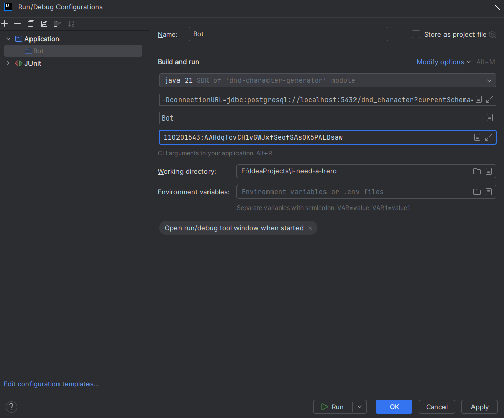

# I Need A Hero

## 📜 Summary
- [About](#-about)
- [Stack](#-stack)
- [Functionality](#-functionality)
- [Contribute](#-contribute)
- [Acknowledgements](#-acknowledgements)

## 🧙‍♀️ About
"I Need A Hero" is a Telegram bot that supports a step-by-step creation of DnD characters. It asks users questions and generates heroes based on the answers. In the end, player gets an editable PDF of their character. 

## 📚 Stack
<div align="center">
  <table>
    <tr>
      <!-- Первая строка -->
      <td align="center" width="110">
        <a href="https://www.java.com" target="_blank">
          
        </a>
        <br>Java 21
      <td align="center" width="110">
        <a href="https://www.postgresql.org/" target="_blank">
          
        </a>
        <br>Postgres 17
      </td>
      </td>
      <td align="center" width="110">
        <a href="https://hibernate.org/" target="_blank">
          
        </a>
        <br>Hibernate
      </td>
      <td align="center" width="110">
        <a href="https://maven.apache.org/" target="_blank">
          
        </a>
        <br>Maven
      </td>
    </tr>
    <tr>
      <!-- Вторая строка -->
      <td align="center" width="110">
        <a href="https://web.telegram.org/" target="_blank">
          
        </a>
        <br>Telegram
      </td>
          <td align="center" width="110">
        <a href="https://junit.org/junit5/" target="_blank">
          
        </a>
        <br>JUnit 5
      </td>
      <td align="center" width="110">
        <a href="https://site.mockito.org/" target="_blank">
          
        </a>
        <br>Mockito
      </td>
    </tr>
  </table>
</div>

Additional libraries:
- Lombok
- Java-telegram-bot-api
- Apache pdf box
- Jackson Mapper

## ✨Funcitonality

#### Create
To start the hero creation process use the `/newhero` command. The bot generates a character based on the user's answers. It can automatically roll for basic hero characteristics or use the dice values entered by the player. It also modifies the character by race, class, and backstory selected by the user.

#### Read
All player's characters are stored in the DB and can be accessed anytime using the `/printhero` command. It sends the PDF charcater sheet to the user.

#### Update
Unfortunately, custom editing is not supported for now

#### Delete
Player can delete their hero anytime using the `/dismisshero` command.

#### Limitations
However, there are some *limitations* as to what the bot can do:

- English only (otherwise the PDF is not generated)
- DnD 5e 2014 only
- No spells 
- 1st level only

## 🏃‍♀️ Run

#### 1. Bot creation
Follow the instructions to create your Telegram bot 👉[here](https://core.telegram.org/bots/features#creating-a-new-bot). In the end, you should get your bot token (Example: `110201543:AAHdqTcvCH1vGWJxfSeofSAs0K5PALDsaw`). Make sure to save it, you will need it for fututre steps. *Keep your token secure and store it safely, it can be used by anyone to control your bot*.

#### 2. Database setup

#### 3. Application launch
**Terminal**
```bash
java 
-DconnectionURL=urlValue
-DconnectionUsername=usernameValue
-DconnectionPassword=passwordValue
-jar i-need-a-hero.jar botApiToken
```
Example:

```bash
java 
-DconnectionURL=jdbc:postgresql://localhost:5432/dnd_character?currentSchema=public
-DconnectionUsername=root
-DconnectionPassword=root
-jar i-need-a-hero.jar 110201543:AAHdqTcvCH1vGWJxfSeofSAs0K5PALDsaw
```

**IntelliJ IDEA**
1. Edit Run Configuration
2. Modify options -> Add VM options
3. Set VM Options:
```bash
-DconnectionURL=urlValue
-DconnectionUsername=usernameValue
-DconnectionPassword=passwordValue
```
4. Program arguments: Enter your bot token



## ✍️ Contribute
I would love to get your contribution, whether it's in form of bug reports, Requests for Enhancement (RFE), documentation, or code patches. Any feedback is more than welcome!

## 🧙 Acknowledgements
Big thanks to Oleg Rekin for guiding me through the proccess of building this bot!
